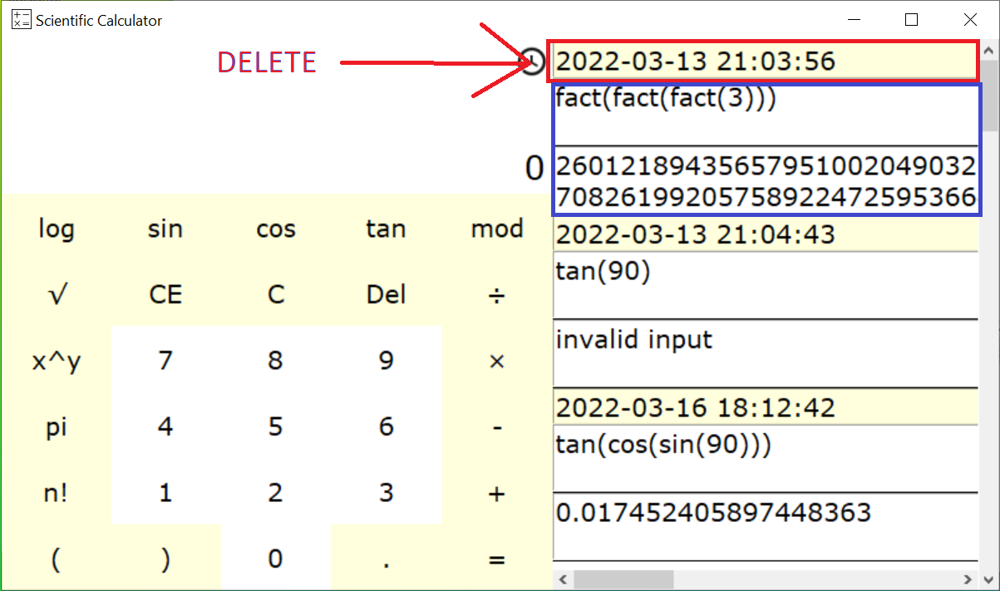

# Scientific_Calculator

 

 

<p dir="rtl" align="right">

این ماشین حساب با زبان پایتون و کتابخانه tkinter همراه با پایگاه داده sqlite توسته داده شده است.

## کلید های میانبر

با این ماشین حساب شما می توانید برخی اعمال را با کلید های میانبر انجام دهید:

</p>

- digits: 0 - 9
- operators: ``` + - * \ % ^ ```
- keys: esc, del, backspace

<p dir="rtl" align="right">

#### محاسبات شما در پایگاه داده ذخیره می شود و شما می توانید هر موقع که به برنامه بروید تاریخچه ای از محاسبات خود را داشته باشید و برای پاک کردن یکی از عبارات در تاریخچه کافی است روی تاریخ ان کلیک کنید تا از تاریخچه پاک شود



#### نکته

اگر عبارت شما از طول کادر برنامه بیشتر شد برای دیدن عبارت خود می توانید روی همان بخش کلید کنید تا پنجره ای برایتان باز شود تا کل محتوای را ببینید

</p>

<br> 

